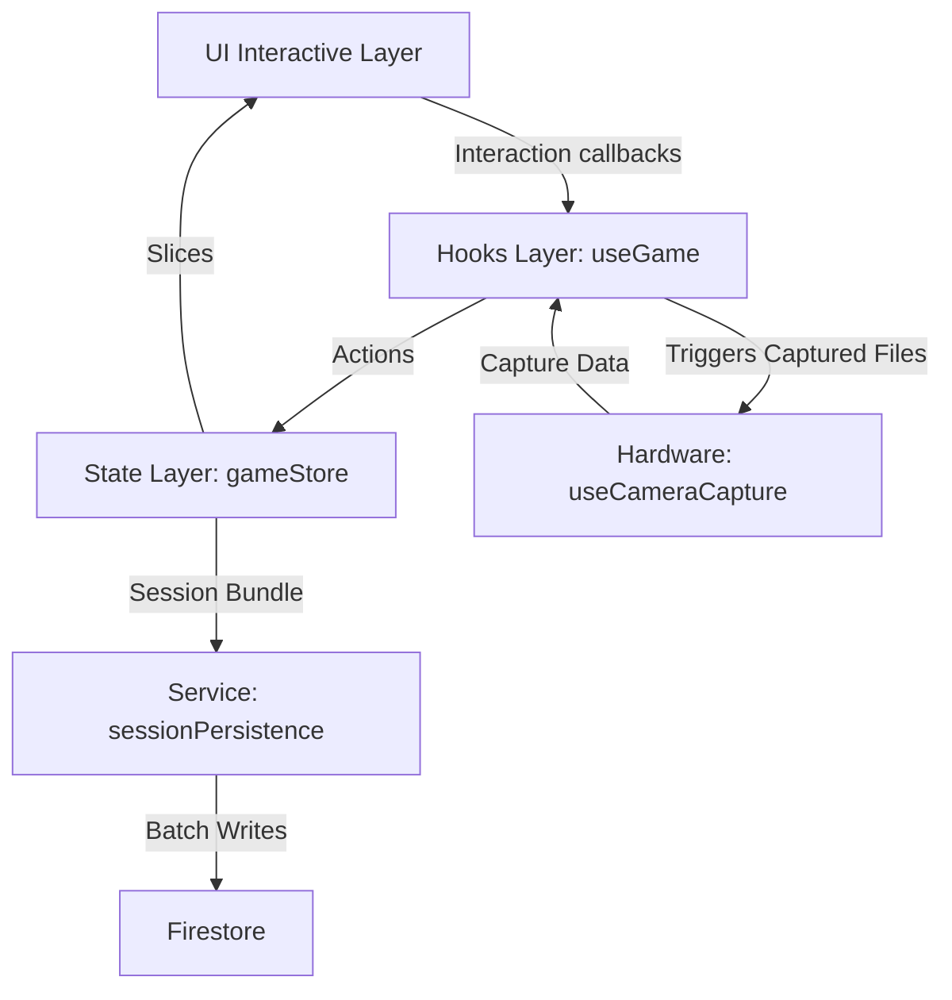

# System Architecture

AttenTap is built with a focus on maintainability, performance, and clear data lineage. This document explores the internal design decisions and data orchestration.

## 🏛 System Design Overview

The application follows a **Uni-directional Data Flow** pattern, primarily driven by a centralized store and encapsulated hooks.

### Core Layers

1.  **UI Components (View Layer)**: Purely defensive React components that render based on store state and trigger callbacks via hooks.
2.  **Custom Hooks (Logic Orchestrator)**: The `useGame` hook acts as the "Controller," coordinating timer logic, item existence, and hardware triggers.
3.  **Zustand Store (State Layer)**: A flat, reactive state container that holds session metadata, active items, and buffered events (`taps`, `captures`, `itemEvents`).
4.  **Services (Infrastructure Layer)**: Handles low-level details like Firestore persistence and platform-specific logic.

## 🔄 Data Flow

The flow of information through the system is strictly defined to ensure consistency:

### 1. Interaction to Store
When a user taps the screen, the UI calls `handleTap(x, y)` from the `useGame` hook. The hook identifies the hit item and dispatches a `recordTap` action to the store.

### 2. Synchronization
During gameplay, events are buffered in the store's memory. When the session ends (time out or manual stop), the `useSessionPersistence` service aggregates these buffers into a `SessionBundle` and performs a transactional write to Firestore.

## 🧠 Why Zustand?

We chose **Zustand** over Redux or Context API for several key reasons:

*   **Flat Structure**: Perfect for logging discrete event streams (taps/captures) without the boilerplate of Redux.
*   **Performance**: Use of shallow selectors ensures components only re-render when their specific data slice changes—critical for a 60FPS game.
*   **Ease of Integration**: Store state can be accessed easily outside of React (e.g., in utility functions or service modules) using `useGameStore.getState()`.

## 🛡 Separation of Concerns

*   **Spawning Logic**: `useItemSpawner` handles *when* and *where* items appear, but doesn't know about the UI.
*   **Capture Logic**: `useCameraCapture` handles the hardware lifecycle, while `useGame` decides *if* a capture should be recorded based on target visibility.
*   **Persistence Logic**: `useSessionPersistence` handles the complexity of "start -> buffer -> end -> sync" cycles, keeping the game logic clean.
